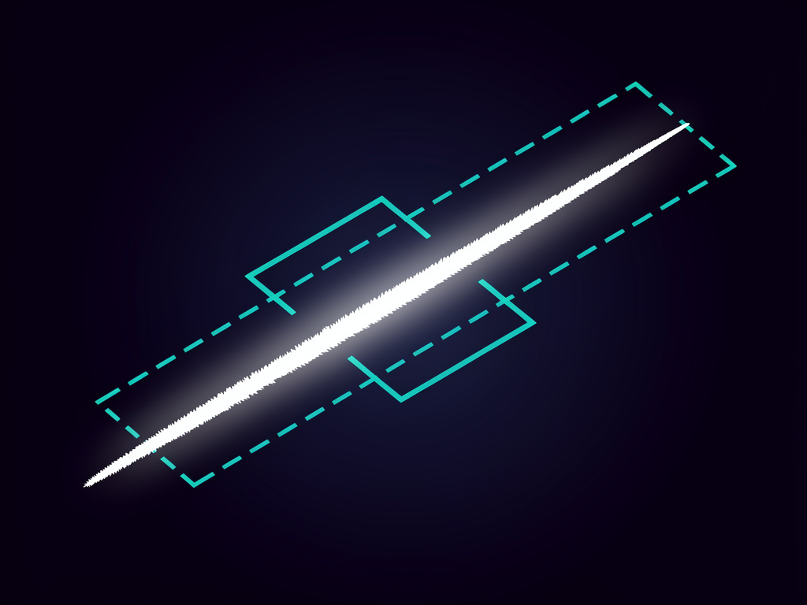
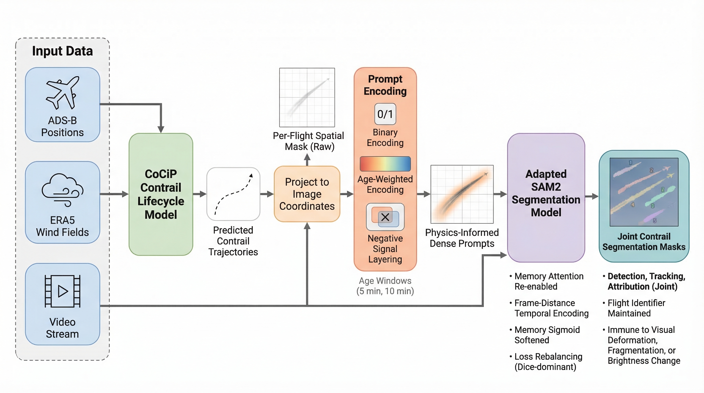

# SAM2-Contrails

<p align="center">
  
</p>

<p align="center">
  <strong>Contrail detection, tracking, and attribution from all-sky camera imagery using SAM2.</strong>
</p>

<p align="center">
  <a href="LICENSE"></a>
  <a href="https://www.python.org/"></a>
  <a href="https://huggingface.co/ramondalmau/sam2-contrails"></a>
  
  <a href="https://zenodo.org/records/16612390"></a>
</p>

This repository contains **SAM2-Contrails**, a fine-tuned version of
[SAM 2](https://github.com/facebookresearch/sam2) for dense contrail segmentation,
tracking, and attribution in ground-based all-sky camera videos.  Given a sequence
of camera frames and ADS-B flight trajectories projected as physics-informed prompt
masks, the model tracks each contrail through the full video and attributes it to its
source flight.

The full methodology, experiments, and results are described in our paper
(preprint will be linked here upon publication).
All design choices — prompt encoding, architecture modifications, training setup,
and evaluation protocol — are explained in detail there.

<p align="center">
  <a href="assets/video_00012.mp4">
    
  </a>
</p>

---

## Pipeline

<p align="center">
  
</p>

The pipeline has three stages:

1. **Prompt generation** — ADS-B positions + ERA5 wind fields → CoCiP or
   DryAdvection contrail model → projected to image pixel coordinates → age-weighted
   ternary prompt masks (positive + negative signal).
2. **SAM2 inference** — physics-informed dense prompts fed into an adapted SAM2
   model; the memory bank propagates each contrail mask through the full video.
3. **Attribution** — each predicted mask carries the flight ID of the prompt that
   seeded it, directly linking every contrail pixel to a source flight.

**Key design choices**

- **Ternary prompt encoding** — a two-channel prompt encodes both the target
  flight's contrail (positive, age-weighted intensity) and all competing flights
  (negative signal), reducing cross-attribution errors.
- **Memory attention re-enabled** — disabled by default in SAM2 video mode,
  re-enabling it was critical for long contrail tracks.
- **Dice-dominant loss** — handles the extreme foreground/background imbalance
  of thin contrail masks.

---

## Dataset

Models are trained and evaluated on the **GVCCS dataset** (Ground-based Video
Camera for Contrail Segmentation), recorded with an all-sky camera at
EUROCONTROL's experimental centre in Bretigny-sur-Orge, France.

> **Dataset**: [GVCCS on Zenodo](https://zenodo.org/records/16612390)

The dataset contains annotated all-sky camera videos with per-flight contrail
segmentation masks, ADS-B flight trajectories, and ERA5 meteorological data.

---

## Installation

**Requirements:** Python >= 3.10, [uv](https://docs.astral.sh/uv/getting-started/installation/), and a CUDA-capable GPU (CPU inference is ~50x slower).

```bash
git clone https://github.com/ramondalmau/sam2-contrails.git
cd sam2-contrails

# Inference only
uv sync --extra inference

# Full install — adds prompt generation from ADS-B + ERA5 data
uv sync --extra all
```

The repo includes a `uv.lock` file for fully reproducible installs. PyTorch is pre-configured for **CUDA 12.8** via `[tool.uv.sources]` in `pyproject.toml`. If your system uses a different CUDA version, edit the index name (e.g. `cu128` → `cu121`) before running `uv sync`. For CPU-only, remove the `[tool.uv.sources]` block.

> The CUDA extension (`sam2._C`) is optional. If it fails to compile, SAM2 still works correctly — see [INSTALL.md](INSTALL.md).

All commands run through `uv run` — no manual environment activation needed:

```bash
uv run python examples/04_run_inference.py --help
```

---

## Model Weights

Pre-trained checkpoints are hosted on
[Hugging Face](https://huggingface.co/ramondalmau/sam2-contrails).

| Variant | Description | mAP | Attr. Precision |
|---------|-------------|-----|-----------------|
| `ternary` | Age-weighted + negative signal (recommended) | 0.380 | 96.2% |
| `original` | Binary baseline (1-min window, positive-only) | 0.303 | 89.0% |

### Auto-download (Python)

```python
from contrailtrack import load_model

# Downloads and caches weights automatically on first call
model = load_model()                    # ternary (recommended)
model = load_model(config="original")   # binary baseline
```

### Manual download

```python
from huggingface_hub import hf_hub_download

path = hf_hub_download("ramondalmau/sam2-contrails", "checkpoints/ternary.pt")
path = hf_hub_download("ramondalmau/sam2-contrails", "checkpoints/original.pt")
```

---

## Quick Start with GVCCS

This walkthrough runs contrail detection on a GVCCS video end-to-end.
It uses video `00001` (the first GVCCS test video) — replace with the
integer COCO video ID of any video you want to process.

```bash
# Set paths (adjust to your setup)
GVCCS=/path/to/GVCCS/test
VID=00001          # COCO integer video ID (zero-padded)
VIDEO=20230930055430_20230930075430  # timestamp name, for parquet lookup

# Step 1: Extract per-video frame folders (named by COCO video ID)
uv run python examples/01_prepare_data.py $GVCCS

# Step 2: Convert ADS-B traffic parquet to a pycontrails Fleet JSON
uv run python examples/02_fleet_from_traffic.py data/parquet/$VIDEO.parquet

# Step 3: Run CoCiP contrail model and generate prompt masks
uv run contrailtrack run-cocip \
    --fleet-dir  data/fleet/ \
    --out        data/cocip/ \
    --annotations $GVCCS/annotations.json \
    --videos $VID

uv run contrailtrack generate-prompts \
    --contrail-dir  data/cocip/ \
    --annotations   $GVCCS/annotations.json \
    --out           data/prompts/ \
    --images-source $GVCCS/images/ \
    --max-age 5.0 \
    --videos $VID

# Step 4: Run SAM2-Contrails inference (downloads weights on first run)
uv run contrailtrack run \
    --images  data/frames/$VID \
    --prompts data/prompts/ \
    --out     results/$VID.json

# Step 5: Evaluate against GVCCS ground truth
uv run contrailtrack evaluate results/$VID.json \
    --labels $GVCCS/annotations.json \
    --out    evaluation/

# Step 6: Render an overlay video (prompts + predictions)
uv run python examples/06_render_video.py \
    --frames      data/frames/$VID \
    --prompts     data/prompts \
    --predictions results/$VID.json \
    --video-id    $VID
```

### Python API

```python
import contrailtrack as ct

video_id = "00001"  # COCO integer video ID (zero-padded)

# Load model — downloads weights from Hugging Face on first call
model = ct.load_model(config="ternary", device="cuda")

# Load frames (returns float32 tensor, no ImageNet normalisation)
frames, frame_names, H, W = ct.load_frames(f"data/frames/{video_id}/", image_size=1024)

# Read prompt masks (ternary encoding: positive own + negative competing)
prompts = ct.read_prompts("data/prompts/", video_id=video_id, encoding="ternary")

# Run SAM2 video inference
predictions = ct.run_video(
    model=model,
    frames=frames,
    frame_names=frame_names,
    prompts=prompts,
    original_height=H,
    original_width=W,
    score_threshold=0.5,
    max_propagation_frames=50,
)

# Export as COCO RLE JSON
ct.export_coco_json(predictions, video_id, frame_names, H, W, f"results/{video_id}.json")

# Evaluate against ground truth (resolves video ID → COCO timestamp name automatically)
results = ct.evaluate(
    predictions_path=f"results/{video_id}.json",
    gt_annotations="path/to/annotations.json",
    video_name=video_id,
)
```

---

## CLI Reference

All functionality is available through the `contrailtrack` command:

```
uv run contrailtrack --help
```

| Command | Description |
|---------|-------------|
| `contrailtrack run-cocip` | Run CoCiP contrail model on fleet JSON files |
| `contrailtrack run-dry-advection` | Run DryAdvection contrail model on fleet JSON files |
| `contrailtrack generate-prompts` | Generate prompt PNGs from contrail model output |
| `contrailtrack run` | Run SAM2 inference: frames + prompts → COCO RLE JSON |
| `contrailtrack evaluate` | Evaluate COCO predictions against ground truth |
| `contrailtrack train` | Fine-tune SAM2 on GVCCS contrail data |

Every batch command accepts an optional `--videos` flag (repeatable) to restrict
processing to a subset of videos.  Leading zeros are optional — `1` and `00001`
are equivalent.

### Full pipeline (annotated dataset)

```bash
FLEET=/path/to/fleet/       # fleet JSON files (one per video, named by timestamp)
ANNOTATIONS=/path/to/annotations.json
FRAMES=/path/to/img_folder/ # per-video JPEG frame folders
CACHE=/path/to/met_cache/   # ERA5 disk cache (reused across runs)

# 1. Run contrail model
uv run contrailtrack run-cocip \
    --fleet-dir  $FLEET \
    --out        data/cocip/ \
    --annotations $ANNOTATIONS \
    --cache-dir  $CACHE

# 2. Generate prompt + GT mask PNGs
uv run contrailtrack generate-prompts \
    --contrail-dir  data/cocip/ \
    --annotations   $ANNOTATIONS \
    --out           data/prompts/ \
    --images-source $FRAMES \
    --max-age 5.0

# 3. Train (optional — skip to use pre-trained weights)
uv run contrailtrack train \
    sam2/configs/sam2.1_training/sam2.1_hiera_b+_GVCCS_finetune_ternary.yaml \
    --num-gpus 2

# 4. Run inference on all test videos
uv run contrailtrack run \
    --images-dir $FRAMES \
    --prompts    data/prompts/ \
    --out        results/ \
    --checkpoint checkpoints/ternary.pt

# 5. Evaluate all predictions
uv run contrailtrack evaluate \
    --predictions-dir results/ \
    --labels          $ANNOTATIONS \
    --out             evaluation/
```

### Processing a subset of videos

All batch commands accept `--videos` (repeat per video ID):

```bash
uv run contrailtrack run-cocip \
    --fleet-dir $FLEET --out data/cocip/ --annotations $ANNOTATIONS \
    --videos 1 --videos 3 --videos 5

uv run contrailtrack generate-prompts \
    --contrail-dir data/cocip/ --annotations $ANNOTATIONS --out data/prompts/ \
    --videos 1 --videos 3 --videos 5

uv run contrailtrack run \
    --images-dir $FRAMES --prompts data/prompts/ --out results/ \
    --videos 1 --videos 3 --videos 5

uv run contrailtrack evaluate \
    --predictions-dir results/ --labels $ANNOTATIONS --out evaluation/ \
    --videos 1 --videos 3 --videos 5
```

### Single video

```bash
uv run contrailtrack run \
    --images  $FRAMES/00001 \
    --prompts data/prompts/ \
    --out     results/00001.json

uv run contrailtrack evaluate results/00001.json \
    --labels $ANNOTATIONS \
    --out    evaluation/00001/
```

### Unannotated traffic (no ground truth)

```bash
# Run contrail model (no --annotations needed)
uv run contrailtrack run-dry-advection \
    --fleet-dir data/fleet/ \
    --out       data/dry_advection/

# Generate prompts without GT masks
uv run contrailtrack generate-prompts \
    --contrail-dir data/dry_advection/ \
    --out          data/prompts/

# Infer (no --labels → no evaluation)
uv run contrailtrack run \
    --images-dir data/frames/ \
    --prompts    data/prompts/ \
    --out        results/
```

> **Data layout produced by `generate-prompts`:**
> Frames are organised as `img_folder/{video_id:05d}/{frame_idx:05d}.jpg` and
> prompts as `per_object_data*/{video_id:05d}/{flight_id}/{frame_idx:05d}_prompt.png`,
> where `video_id` is the COCO integer video ID and `flight_id` is the hex ADS-B
> flight identifier.

---

## Examples

| Script | Description |
|--------|-------------|
| [`01_prepare_data.py`](examples/01_prepare_data.py) | Extract per-video frame folders from the flat GVCCS image directory |
| [`02_fleet_from_traffic.py`](examples/02_fleet_from_traffic.py) | Convert ADS-B traffic parquet to pycontrails Fleet JSON |
| [`03_generate_prompts.py`](examples/03_generate_prompts.py) | Generate prompt masks (CoCiP or DryAdvection) — for unannotated / custom data |
| [`04_run_inference.py`](examples/04_run_inference.py) | Run SAM2-Contrails on a frame sequence |
| [`05_evaluate.py`](examples/05_evaluate.py) | Evaluate predictions against GVCCS ground truth |
| [`06_render_video.py`](examples/06_render_video.py) | Render overlay video with prompts and predictions |

---

## Prompt Generation

Prompt masks encode where each flight's contrail is expected to appear in each
frame.  Two contrail models are supported — both produce compatible output and
can be used interchangeably in all downstream steps.

### CoCiP (recommended for accuracy)

Full thermodynamic contrail lifecycle model.  Predicts persistence, lifetime, and
contrail width.  Requires ERA5 meteorology and radiation data via a
[CDS API key](https://cds.climate.copernicus.eu/how-to-api).

```python
import pandas as pd
from contrailtrack.prompts.cocip import run_cocip
from contrailtrack.prompts.projection import MiniProjector
from contrailtrack.prompts.writer import generate_prompts_video

stem = "20230930055430_20230930075430"

# Step 1: Run CoCiP — saved to disk so ERA5 downloads are not repeated
contrail_path = run_cocip(fleet_json=f"data/fleet/{stem}.json", output_dir="data/cocip/")

# Step 2: Write per-flight prompt PNGs (projection to pixel space happens in-memory)
generate_prompts_video(
    images_dir=f"data/frames/{stem}/",
    contrail_df=pd.read_parquet(contrail_path),
    output_dir="data/prompts_cocip_age5/",
    video_id=stem,
    projector=MiniProjector(),   # defaults to GVCCS camera constants
    max_age_min=5.0,
)
```

### DryAdvection (faster, no radiation data)

Advects flight waypoints using ERA5 wind fields only.  No radiation data, no
aircraft performance model.  Recommended for rapid prototyping or when ERA5
radiation is unavailable.

```python
import pandas as pd
from contrailtrack.prompts.dry_advection import run_dry_advection
from contrailtrack.prompts.projection import MiniProjector
from contrailtrack.prompts.writer import generate_prompts_video

stem = "20230930055430_20230930075430"

contrail_path = run_dry_advection(fleet_json=f"data/fleet/{stem}.json",
                                  output_dir="data/dry_advection/")
generate_prompts_video(
    images_dir=f"data/frames/{stem}/",
    contrail_df=pd.read_parquet(contrail_path),
    output_dir="data/prompts_dry_advection_age5/",
    video_id=stem,
    projector=MiniProjector(),
    max_age_min=5.0,
)
```

---

## Fine-tuning

To fine-tune on your own GVCCS split, first generate training prompts with GT
masks, then launch training.

### 1. Prepare training data

```bash
# Run contrail model on the train split
uv run contrailtrack run-cocip \
    --fleet-dir  /path/to/fleet/train/ \
    --out        /path/to/cocip/train/ \
    --annotations /path/to/GVCCS/train/annotations.json

# Generate age-weighted prompts + GT masks
uv run contrailtrack generate-prompts \
    --contrail-dir  /path/to/cocip/train/ \
    --annotations   /path/to/GVCCS/train/annotations.json \
    --out           /path/to/GVCCS/train/per_object_data_age_5/ \
    --images-source /path/to/GVCCS/train/images/ \
    --max-age 5.0
```

This writes:
```
per_object_data_age_5/
  {video_id:05d}/
    {flight_id}/
      {frame_idx:05d}_prompt.png   # age-weighted prompt
      {frame_idx:05d}_mask.png     # GT segmentation mask
    {frame_idx:05d}_all_prompts_union.png  # union of all flight prompts (ternary)
img_folder/
  {video_id:05d}/
    {frame_idx:05d}.jpg            # symlinks to source images
```

Update the `img_folder` and `gt_folder` paths in your training config YAML to
point to these directories.

### 2. Launch training

```bash
# Age-weighted 5-min prompts, 2 GPUs
uv run contrailtrack train \
    sam2/configs/sam2.1_training/sam2.1_hiera_b+_GVCCS_finetune_age.yaml \
    --num-gpus 2

# Ternary prompts (recommended)
uv run contrailtrack train \
    sam2/configs/sam2.1_training/sam2.1_hiera_b+_GVCCS_finetune_ternary.yaml \
    --num-gpus 2
```

Available training configs (in `sam2/configs/sam2.1_training/`):

| Config | Prompts | Notes |
|--------|---------|-------|
| `..._finetune_age.yaml` | Age-weighted, 5-min window | Recommended starting point |
| `..._finetune_ternary.yaml` | Ternary (positive + negative), 5-min | Best attribution precision |
| `..._finetune_original.yaml` | Binary, 1-min window | Baseline |

Checkpoints and TensorBoard logs are written to the `experiment_log_dir`
specified in the config (default: `./logs/`).

Before training, download the SAM 2.1 base checkpoint:

```bash
bash checkpoints/download_ckpts.sh
```

---

## Evaluation

Predictions are evaluated against GVCCS ground-truth annotations on three
axes: segmentation mAP, tracking (detection rate, completeness, temporal IoU),
and attribution (is each prediction assigned to the correct flight?).

```python
from contrailtrack import evaluate

results = evaluate(
    predictions_path="results/20230930055430_20230930075430.json",
    gt_annotations="path/to/annotations.json",
    video_name="20230930055430_20230930075430",
    output_dir="evaluation/",
)
print(f"mAP:                {results['segmentation']['mAP']:.3f}")
print(f"Detection rate:     {results['tracking']['metrics']['detection_rate']:.1%}")
print(f"Attr. precision:    {results['attribution']['metrics']['attribution_precision']:.1%}")
```

---

## Repository Structure

```
sam2/               SAM2 base model (Meta AI, Apache 2.0)
  configs/            Training and inference YAML configs
contrailtrack/      Contrail-specific package
  model/              Model loading and Hugging Face Hub integration
  data/               Frame loading, prompt reading
  inference/          SAM2 video predictor wrapper
  output/             COCO RLE export
  eval/               Segmentation, tracking, and attribution metrics
  prompts/            CoCiP, DryAdvection, camera projection, prompt writer
training/           Fine-tuning code (dataset, sampler, loss, trainer)
examples/           Step-by-step usage examples (01–06)
assets/             Figures and logo
```

---

## Citation

If you use SAM2-Contrails in your research, please cite our paper:

```bibtex
@article{dalmau2025contrails,
  title   = {Contrails Cannot Exist Without Flights:
             Physics-Informed Detection, Tracking, and Attribution},
  author  = {Dalmau, Ramon and Jarry, Gabriel and Very, Philippe},
  year    = {2025},
}
```

Please also cite the original SAM 2 paper:

```bibtex
@article{ravi2024sam2,
  title   = {SAM 2: Segment Anything in Images and Videos},
  author  = {Ravi, Nikhila and Gabeur, Valentin and Hu, Yuan-Ting and others},
  journal = {arXiv preprint arXiv:2408.00714},
  year    = {2024},
}
```

---

## Acknowledgements

We are grateful to the following organisations and projects:

- **[Reuniwatt](https://www.reuniwatt.com)** — for providing the all-sky camera
  used to record the GVCCS dataset.
- **[Encord](https://encord.com)** — for the annotation platform used to label
  the contrail segmentation masks.
- **[OpenSky Network](https://opensky-network.org)** — for providing the ADS-B
  flight trajectory data used to generate contrail prompts.
- **[pycontrails](https://github.com/contrailcirrus/pycontrails)**
  — for the CoCiP and DryAdvection contrail models.
- **[Meta AI](https://github.com/facebookresearch/sam2)** — for SAM 2, the
  foundation model this work builds upon.
- **[cc_torch](https://github.com/zsef123/Connected_components_PyTorch)** — for
  the GPU connected-component post-processing
  (see [LICENSE_cctorch](LICENSE_cctorch)).

---

## License

The `contrailtrack` package is released under the
[European Union Public Licence v1.2 (EUPL-1.2)](LICENSE).

The SAM 2 base model code (in `sam2/`) retains its original
[Apache 2.0 License](https://github.com/facebookresearch/sam2/blob/main/LICENSE)
from Meta AI.
